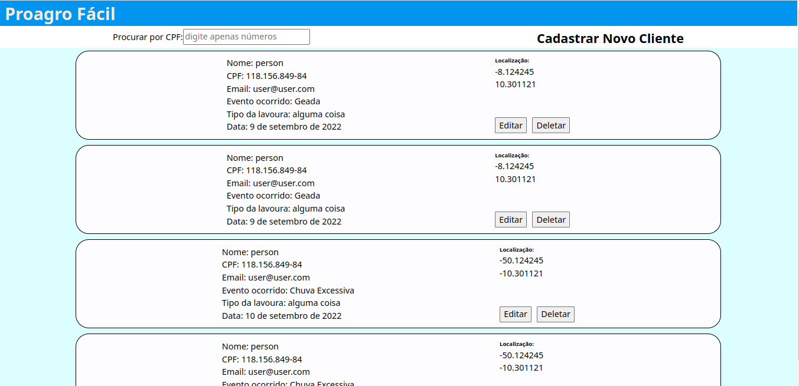
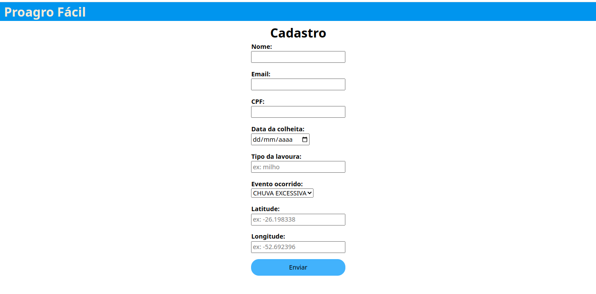

## Teste SoftFocus Full stack

Clicando [aqui](https://github.com/MarcosDurval/softFocus-back) você encontra o back end
## Construção

A aplicação foi construida usando React com typescript  
Para criação dos testes foi usado o vitest
### Tela de listagem

### Tela de cadastro


## Como rodar localmente

##### Para conseguir usar todas as funcionalidades do front end é necessário que o back end esteja em execução

Clone o Projeto:
```
git clone: git@github.com:MarcosDurval/softFocus-front.git
```
Acesse diretorio:
```
cd softFocus-front
```

Renomeie o arquivo .env.example para .env  

Instale as dependências:

```
npm install
```

Inicie o Projeto:

```
npm run dev
```
Rode os Testes:

```
npm run test
```

Rode os Testes com a saida do coverage:

```
npm run test:coverage
```
